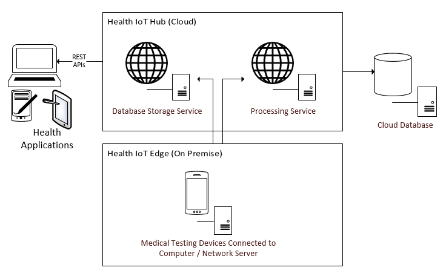

# Introduction

The purpose of the Laboratory Information System \(LIS\) Connector project is to provide a computer system to facilitate the following:

* Allow medical testing devices to communicate electronically with the system
* To decode HL7, ASTM and POCT messages received from medical testing devices
* To save decoded data from medical devices to a cloud database
* Provide access to the cloud data via REST APIs

### System Description

### Internet of Things \(IoT\)

The Internet of Things \(IoT\) or Internet of Medical Things \(IoMT\) is a term used to describe the concept of devices connecting to computer systems to transfer and receive data. Ultimately, this data is stored in a cloud system and is made available for users for viewing and analyzing. IoT supports Big Data Analysis, Machine Learning and Artificial Intelligence systems.

### Health IoT Edge

Computing at the edge allows medical testing devices to transmit data electronically to the local network server or a local computer on premise. The medical devices will communicate directly with the computer system via a TCP connection. In addition, the devices will communicate with a lower layer protocol such as MLLP. To accommodate device connections, an architecture was designed to support connectivity of devices via TCP using lower layer protocols defined by the relevant HL7, ASTM or POCT connectivity standards that the devices support. Health IoT Edge is a series of Windows Services that listens for HL7, ASTM and POCT messages from the medical devices on a specified TCP port at a specified IP Address.

 Health IoT Edge runs as a desktop application on following operating systems:

* Windows 7
* Windows 8, 8.1
* Windows 10

The functions of Health IoT edge are to:

* Receive messages over a TCP connection from the medical testing devices
* Read the message from the lower layer protocols
* Package and send the message to a cloud service \(Processing Service\) for decoding
* After receiving the decoded message, send the message to another cloud service \(Database Storage Service\) to save the data in a cloud database

Medical testing devices can connect to the computer system by any of the following methods:

* Ethernet
* Serial
* USB
* Wi-Fi
* Via a hub or other electronic device supplied by the device manufacturer

### **Health IoT Hub**

Health IoT Hub is a set of cloud-based REST APIs that decodes device messages, saves message data to a cloud database and provides access to the data to health software applications via REST APIs.

#### **Processing Service**

The processing service is a REST API that receives HL7, ASTM and POCT messages from the Health IoT Edge application and decodes this message to a format for further data processing. It returns the decoded message to the Health IoT Edge application as JSON.

#### **Database Storage Service**

The database storage service is a REST API that will receive decoded messages from the Health IoT Edge application and will save the data to a cloud database.

#### Security

The Health IoT Hub enforces a secured TLS/HTTPS connection for data security. In addition, the REST APIs can only be accessed through OAuth 2 authorized requests.

#### Consuming the REST APIs

The Health IoT Hub will provide access to the data in the cloud database through the Database Storage Service. This API can be consumed by desktop, web and mobile health software applications. The data can also be used for Big Data Analysis , Machine Learning and Artificial Intelligence.

