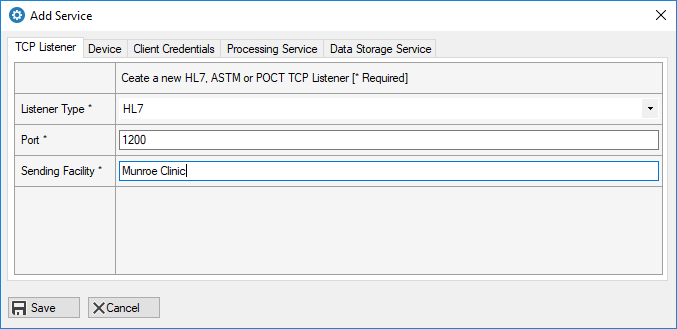
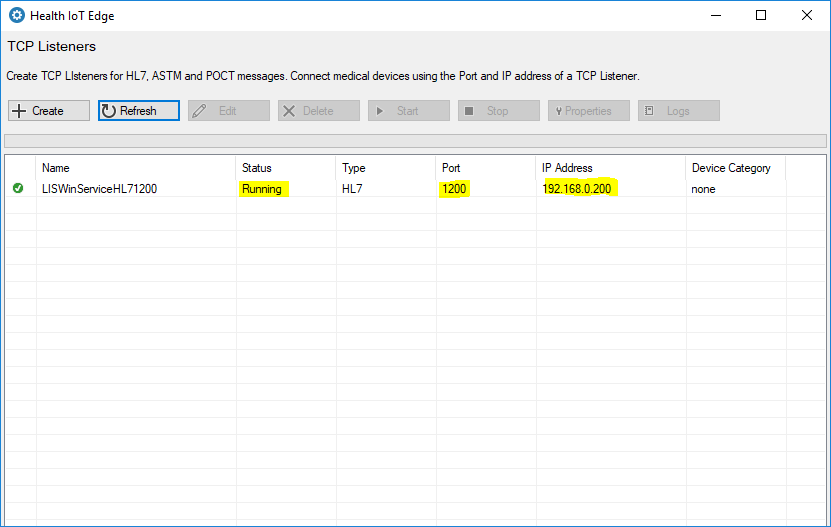

# Create a TCP Listener

In this section, you will create a TCP listener to listen for messages from a medical testing device.

Open the Health IoT Edge application as an 'Administrator'.

In the main screen , click on the 'Create' button.

In this example, we will create an HL7 TCP Listener.

In the main screen, select the listener and click on the 'Start' button to start the listener.

The listener is now started and is listening on port 1200 at IP 192.168.0.200 for HL7 messages from medical testing devices connected to the computer system.

