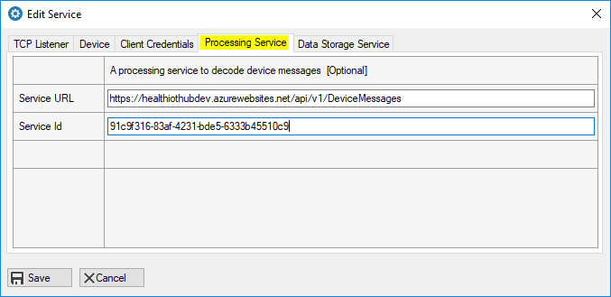
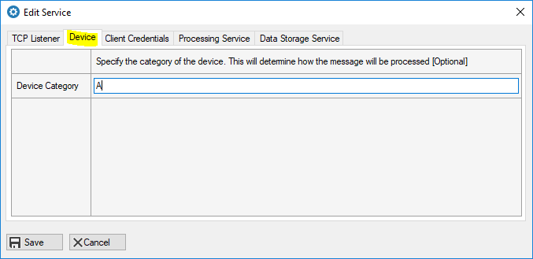
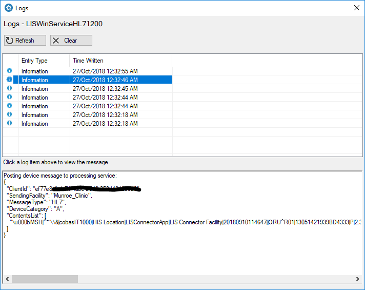
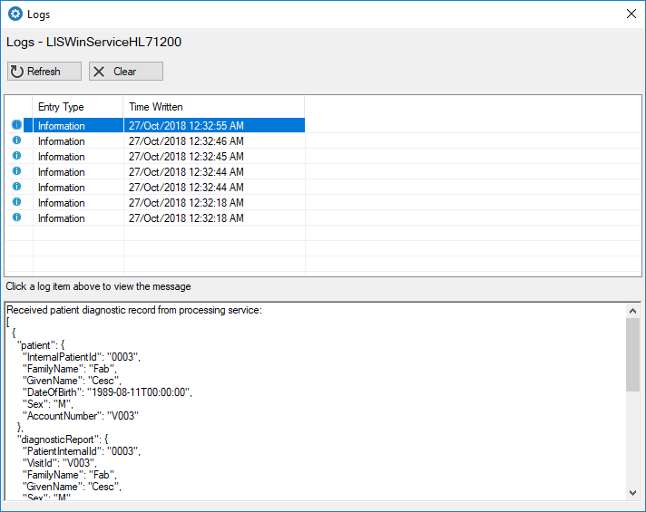

# Process a message

In this section, you will decode a message using the Processing Service from the Health IoT Hub.

The Health IoT Edge application will receive messages from medical devices using TCP Listeners. It will then post the the HL7,  ASTM or POCT message to the Processing Service REST API in the Health IoT Hub for decoding.

### Client Credentials

The REST API implements OAuth 2 protocols for secured access. HTTPS is also enforced. To access the API you will require the following credentials:

* **Token URL** - The endpoint URL to acquire a short lived JWT access token
* **Client Id** - An id to identify your client application
* **Client Secret** - A secret key to be used by your client application

You will configure these parameters in your Health IoT Edge application that will act as your client to access the secured APIs. In the main screen, select the TCP Listener, and then click on the 'Edit' button. Enter your credentials in the 'Client Credentials' tab and click the 'Save' button.


**Sandbox Testing Client Credentials**

To allow for Sandbox Testing, we are providing the following test credential to our development servers. 

Token URL: [https://login.microsoftonline.com/3b271d51-f2d1-4a78-bbdb-7897de54f3f8/oauth2/token](https://login.microsoftonline.com/3b271d51-f2d1-4a78-bbdb-7897de54f3f8/oauth2/token)  
Client Id: ef77e8cf-eb71-4abe-b548-253d48d2c5d0  
Client Secret: X/YXLpjY3uawZGV7L4l7DacbluaiI4caO205xurNuOo=


Please be considerate when using our development servers. It is not a production server and is not designed for heavy traffic. Please protect the name of patients or use fictitious names when testing. Server data will be purged on a weekly basis.


### Processing Service

After configuring the client credentials, you must add the Service URL for the processing service and the Service Id. You will add these parameters in the 'Processing Service' tab.



**Sandbox Testing Parameters**

The following parameters are provided for testing on our development server.

Service Url : [https://healthiothubdev.azurewebsites.net/api/v1/DeviceMessages](https://healthiothubdev.azurewebsites.net/api/v1/DeviceMessages)  
Service Id: 91c9f316-83af-4231-bde5-6333b45510c9

### Device Category

Devices are grouped within categories for message processing. Each category will contain devices and clinical tests supported by the message processor extensions. You can view the Device Category section to find the device and clinical tests that are supported. If you do not see your device, follow the instructions in the link below to work with us to build a message processor extension for your device:

[Request a new device category](../sandbox-testing/request-a-new-processor-category.md)

In the 'Device' tab, add the device category that contains your device. The Device Category A supports the sample message that we will use throughout this guide.




You must **stop** and **restart** the TCP Listener for the new configurations to take effect. Please wait for about 30 seconds before re-starting the service since you may experience a 'socket in use' error if it is re-started too quickly.


### Processing A Sample Message

The following message is generated from a **Category A** device. We will use the Smart HL7 Sender simulator to send this message to our  TCP Listener for decoding. 

```text
MSH|^~\&amp;|cobasIT1000|HIS Location|LISConnectorApp|LIS Connector Facility|20180910114647||ORU^R01|13051421939BD4333|P|2.3|||NE|SU
PID|1||0003||Fab^Cesc^||19890811|M||||||||||V003
PV1|1||A1||||||||||||||||V003
ORC|NW|^HIS|||CM||||20180910114059
OBR||^HIS||||||||||||||||||||20180910114122|||F
OBX|1|ST|PATID|1|0003||||||F
OBX|2|ST|VISIT|1|V003||||||F
OBX|3|ST|LASTNAME|1|Fab||||||F
OBX|4|ST|FIRSTNAME|1|Cesc||||||F
OBX|5|ST|SEX|1|M||||||F
OBX|6|ST|DATEOFBIRTH|1|19890811||||||F
OBX|7|ST|ANALYZERNAME|1|ACI II UU13013667||||||F
OBX|8|ST|ANALYZEDATETIME|1|20180910114122||||||F
OBX|9|ST|OPID|1|ROCHE||||||F
OBX|10|ST|Glu2|1|67|mg/dL|-||||F|||20180910114122
OBX|11|ST|COMMENT1|1|Doctor Notified||||||F
```

First the message will be read by the Health IoT Edge application, the message will then be posted to the Health IoT Hub Processing Service. The image below shows the message that is posted to the Processing Service API.



The Processing Service API will return a JSON of the decoded message. You can view the processed message in the Logs. The response from the Processing Service API is a JSON representation of the decoded message.



You can learn more about the APIs and message processing at the following link:

[Message Processor](../health-iot-hub/untitled.md)


