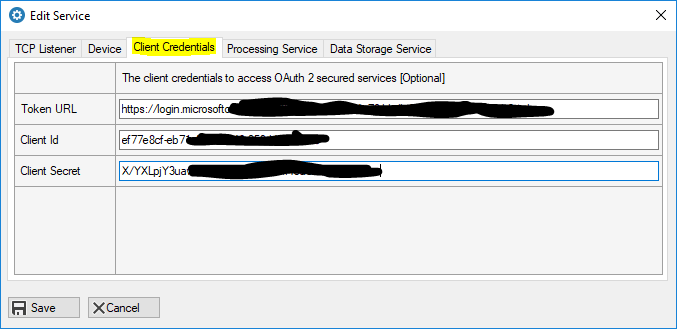

# Process a message

In this section we will decode a message using a cloud service from the Health IoT Hub.

The Health IoT Edge application will receive messages from medical devices using TCP Listeners. It will then post the the HL7,  ASTM or POCT message to a REST API in the Health IoT hub for decoding.

The REST API required use OAuth 2 to provide security acceess to the APIs. HTTPS is also enforced. To access the API you will require the following credentials:

* **Token URL** - The endpoint URL to acquire a short lived JWT access token
* **Client Id** - An id to identify your client application
* **Client Secret** - A secret key to be used your client application

You will configure these parameters in your Health IoT Edge application that will act as your client to access the secured APIs. In the main screen, select the TCP Listener, and then click on the 'Edit' button. Enter your credentials in the 'Client Credentials' tab.

