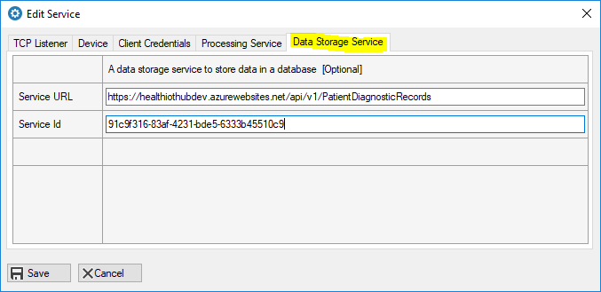
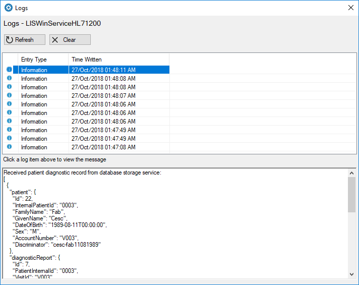

# Save data to a database

In this section, you will learn how to save message data to a cloud database.

The Health IoT Edge application will post a decoded message to the Health IoT Hub Database Storage API to save data to a database.

Before you configure the Database Storage Service in Health IoT Edge, you must configure the client credentials to access the secured APIs as described in the last section.

In the Data Storage Service tab, add the Service URL and the Service Id for the Data Storage Service. 

Restart the service for the configuration to take effect and send the sample message as described in the last section. Remember to wait for 30 seconds after you stop the service before you re-start it.

The data will be saved to a cloud database and the details of the records will be returned from the Database Storage API as a JSON string.

  
To learn more about the Database Storage Service, you can read this link:

[Database Storage](../health-iot-hub/untitled-1.md)

