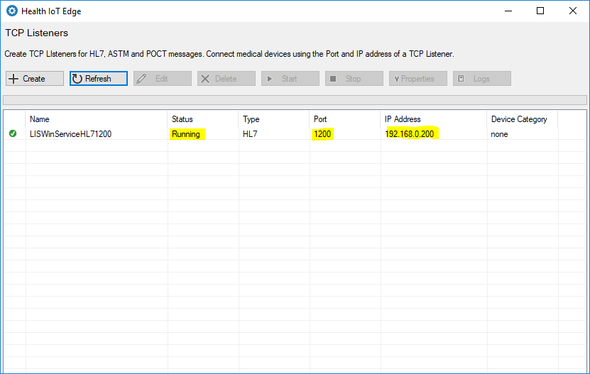
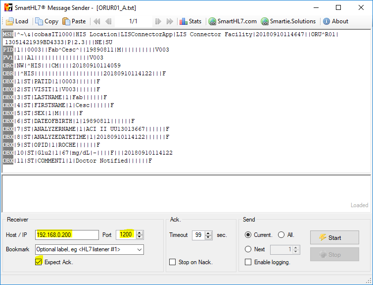
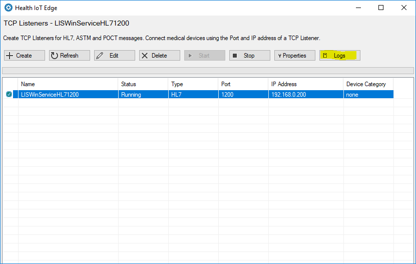
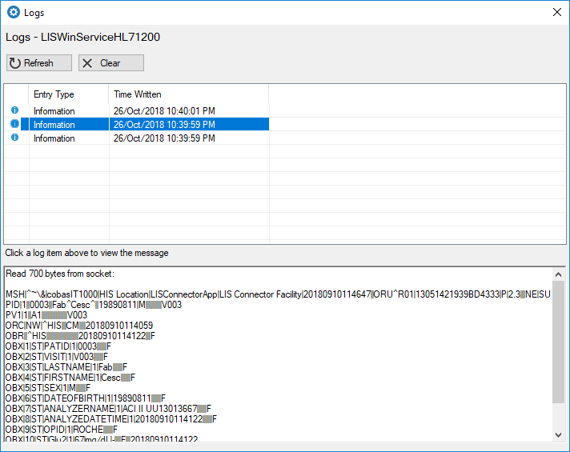

# Receive a message

In this section, we will lean how to receive and view a message sent from a medical IoT device.

Ensure that your have set up a TCP Listener and it is running. Take note of the **Port** number and **IP address** of the TCP Listener.

Connect the medical device to the computer or network server where you installed Health IoT Edge. The device can be connected with an ethernet cable, serial connector, usb, wi-fi or other suitable. Some manufacturers may provide hubs or other electrical equipment to connect their device to a computer system.

Configure the medical device to connect to the Port number and IP address of your TCP Listener. Take readings on the device and send the messages to your TCP Listener.

In the following example, we will use a simulator to send messages to the TCP Listener.

You can download an install the **Smart HL7 Sende**r simulator at the following link.



Load a sample HL7 message and configure the sender to send the message to your TCP Listener's  Port number and IP address. 

You can find sample HL7 messages at the following link:



After you send the message, you can view the received message in the Health IoT Edge logs. To view the logs, in the main screen select the TCP Listener and then click on the 'Logs' button.

In the 'Logs' window, select a log item to view the detailed log entries. You can view the HL7 message sent by the simulator in the log entries.

