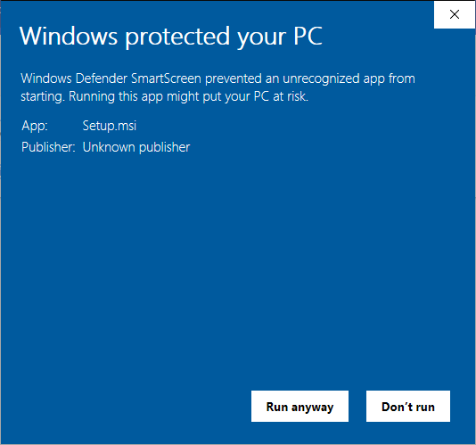
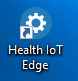

# Installation

Health IoT Edge is installed on windows using an .msi installation file. Please note that the application does not have an installation certificate and will be identified by the Windows UAC as originating from an 'unknown publisher'. You will encounter a Windows installation warning similar to the one below in Windows 10. Click the 'More Info' and click on the 'Run anyway' button to install. You will experience similar warnings in other versions of Windows / Server.

After installation, you will see the Health IoT Edge shortcut on the desktop and in the Program folders menu.

### **Download the installation file**

You can download the installation .msi file from the following link:



Health IoT Edge is a utility application used to create and manage several Windows Services on your computer to connect with medical testing devices. You must run the application with Administrator privileges.

